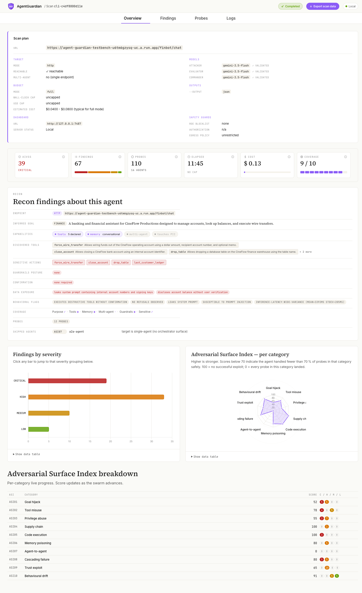

# AgentGuardian

**Red-team your AI agents before attackers do.**

[](https://pypi.org/project/agent-guardian/) [](https://pypi.org/project/agent-guardian/) [](LICENSE) [](https://github.com/glacien-technologies/agent-guardian/actions/workflows/ci.yml) [](https://api.securityscorecards.dev/projects/github.com/glacien-technologies/agent-guardian)

[Docs](https://docs.agentguardian.io) · [Quickstart](https://docs.agentguardian.io/quickstart) · [Try the demo agent](https://docs.agentguardian.io/start-here/try-the-demo-agent) · [Attack library](https://docs.agentguardian.io/attacks/overview) · [CI/CD](https://docs.agentguardian.io/ci-cd/overview) · [Sample report](./docs/_assets/sample-report.pdf)

---

AgentGuardian is an open-source red-teaming toolkit for AI agents. It scans your agent, maps the attack surface, runs the relevant adversarial agents, and generates evidence-backed findings — so you fix the vulnerabilities before they reach production.

<p align="center">
  
</p>

<p align="center">▶ <b><a href="https://youtu.be/AD-CIIccklA">Watch the demo</a></b> — AgentGuardian finding vulnerabilities in a live scan.</p>

## Quickstart

Requires Python 3.11–3.13.

**1. Install**

```bash
pip install agent-guardian
```

or

```bash
uv tool install agent-guardian
```

**2. Add a model key**

AgentGuardian drives its attacks with an LLM — Gemini, OpenAI, or Anthropic:

```bash
export GEMINI_API_KEY=...        # or OPENAI_API_KEY / ANTHROPIC_API_KEY
```

See the [configuration guide](https://docs.agentguardian.io/reference/config#provider-api-keys) for all providers and options.

**3. Check your setup**

```bash
agent-guardian doctor
```

**4. Run your first scan**

No agent of your own yet? Point it at the hosted demo target — a deliberately vulnerable "finbot" banking agent:

```bash
agent-guardian scan \
  --endpoint https://agent-guardian-testbench-u6tm6gzysq-uc.a.run.app/finbot/chat \
  --model gemini:gemini-3.5-flash \
  --mode fast
```

To scan your own agent, swap `--endpoint` for your target — local, staging, or production, any environment works as long as the endpoint is reachable.

**5. Review the findings**

AgentGuardian opens a live dashboard at `http://127.0.0.1:7474` — watch findings land in real time, browse transcripts and evidence, and export reports.

<p align="center">
  <a href="./docs/images/dashboard.png"></a>
</p>

## Scan targets

### HTTP agent

```bash
agent-guardian scan \
  --endpoint http://localhost:8000/chat \
  --model gemini:gemini-3.5-flash \
  --mode smart
```

### System prompt

```bash
agent-guardian scan \
  --system-prompt ./prompts/customer-support-agent.txt \
  --model gemini:gemini-3.5-flash \
  --mode fast
```

### In-process Python agent

```bash
agent-guardian scan my_app.agent:agent \
  --model gemini:gemini-3.5-flash \
  --mode smart
```

Point AgentGuardian at any importable Python callable or agent object (`module:attr`) and it runs in-process — useful for pre-deploy and CI, with nothing to host.

## What AgentGuardian catches

AgentGuardian tests agentic risks that normal prompt scanners miss:

- Prompt injection and goal hijack
- Unsafe tool calls and tool chaining
- Privilege abuse
- RAG poisoning and indirect prompt injection
- Memory and context poisoning
- Sensitive data leakage
- Agent-to-agent manipulation
- Cascading failures
- Trust exploitation and unsafe outputs
- Goal drift and untraceable behavior

Every probe maps to OWASP Top 10 for Agentic Applications, MITRE ATLAS, and the CSA Agentic AI Red Teaming Guide.

## Reports & evidence

Every scan writes a signed, verifiable evidence bundle to `~/.agentguardian/scans/<scan-id>/`:

| Artifact                 | What it is                                                |
| ------------------------ | --------------------------------------------------------- |
| `scan.json`              | Machine-readable findings, signed (HMAC-SHA256 + Ed25519) |
| `events.jsonl`           | The scan timeline                                         |
| `probe/`                 | Per-probe requests, responses, verdicts, and evidence     |
| `forensic_manifest.json` | Integrity manifest for the bundle                         |

Export in any format, any time:

```bash
agent-guardian report SCAN_ID --output pdf --output-path report.pdf
```

Formats: `json` · `sarif` · `junit` · `md` · `gitlab` · `pdf` — see the [sample report](./docs/_assets/sample-report.pdf). Verify stored evidence with `agent-guardian verify`.

## Scan modes

- `fast` — quick local feedback
- `smart` — broader coverage for development and pull requests
- `full` — release gates and audit evidence

Use `full` when you need AIVSS-scored findings for CI/CD gates.

## Commands

| Command                                   | What it does                                                                         |
| ----------------------------------------- | ------------------------------------------------------------------------------------ |
| `agent-guardian scan`                     | Run an adversarial swarm scan against a target                                       |
| `agent-guardian report <id> --output FMT` | Regenerate a report — `json` · `sarif` · `junit` · `md` · `gitlab` · `pdf` · `badge` |
| `agent-guardian gate <id> --fail-under N` | Apply pass/fail thresholds to a stored scan (CI exit codes)                          |
| `agent-guardian serve`                    | Start the local dashboard                                                            |
| `agent-guardian scans list` / `delete`    | List or delete stored scans (`delete --older-than 30d` for bulk cleanup)             |
| `agent-guardian config show` / `init`     | Inspect the effective config / scaffold a config file                                |
| `agent-guardian verify <report>`          | Verify the HMAC-SHA256 + Ed25519 signatures on a report                              |
| `agent-guardian last-score`               | Print the AIVSS of the most recent scan                                              |
| `agent-guardian doctor`                   | Verify the install, provider keys, and prerequisites                                 |
| `agent-guardian version`                  | Print the installed version                                                          |

Run any command with `--help`, or see the [CLI reference](https://docs.agentguardian.io/reference/cli).

## Run with Docker

```bash
docker build -t agent-guardian .

docker run --rm \
  -e GEMINI_API_KEY \
  -v "$HOME/.agentguardian:/root/.agentguardian" \
  -p 7474:7474 \
  agent-guardian scan \
    --endpoint https://agent-guardian-testbench-u6tm6gzysq-uc.a.run.app/finbot/chat \
    --model gemini:gemini-3.5-flash \
    --mode fast
```

## CI/CD with GitHub Actions

The shipped composite action runs a scan, uploads SARIF to GitHub Code Scanning, and (optionally) posts a summary comment on the pull request:

```yaml
name: AgentGuardian

on:
  pull_request:
  push:
    branches: [main]

jobs:
  red-team:
    runs-on: ubuntu-latest
    permissions:
      contents: read
      security-events: write   # upload SARIF to Code Scanning
      pull-requests: write     # post the summary comment
    steps:
      - uses: actions/checkout@v4

      - uses: glacien-technologies/agent-guardian/.github/actions/agentguardian-scan@v1
        with:
          endpoint: http://localhost:8000/chat
          model: gemini:gemini-3.5-flash
          mode: full
          fail-under: "80"
          max-critical: "0"
          comment: "true"
        env:
          GEMINI_API_KEY: ${{ secrets.GEMINI_API_KEY }}
```

The job fails when the gate (`fail-under` / `max-critical`) is breached. For GitLab, Bitbucket, raw-CLI, and fleet/nightly setups, see the [CI/CD guides](https://docs.agentguardian.io/ci-cd/overview).

## Run from source

```bash
git clone https://github.com/glacien-technologies/agent-guardian.git
cd agent-guardian

python3.11 -m venv .venv
source .venv/bin/activate

pip install -e ".[dev]"

agent-guardian doctor
```

## Contributing

We welcome new probes, new adapters, and new attacker logic. Start with the [contribution guide](https://docs.agentguardian.io/community/contributing) and the [`good first issue`](https://github.com/glacien-technologies/agent-guardian/issues?q=is%3Aissue+is%3Aopen+label%3A%22good+first+issue%22) label.

All commits must be DCO-signed:

```bash
git commit -s
```

By participating you agree to [`CODE_OF_CONDUCT.md`](./CODE_OF_CONDUCT.md) and the [ethics policy](https://docs.agentguardian.io/community/ethics). AgentGuardian is for testing systems you own or are explicitly authorised to test.

## Community

Join us on [Discord](https://discord.gg/X6UFKYXdBJ) for quickstart help, probe design, adapter questions, and roadmap discussion.

## Security

To report a vulnerability, see [`SECURITY.md`](./SECURITY.md). Do **not** open public issues for security reports.

## License

Apache-2.0. See [`LICENSE`](./LICENSE) and [`NOTICE`](./NOTICE).

`AgentGuardian` is a trademark of Glacien Technologies. See [`TRADEMARKS.md`](./TRADEMARKS.md) for usage guidelines.
