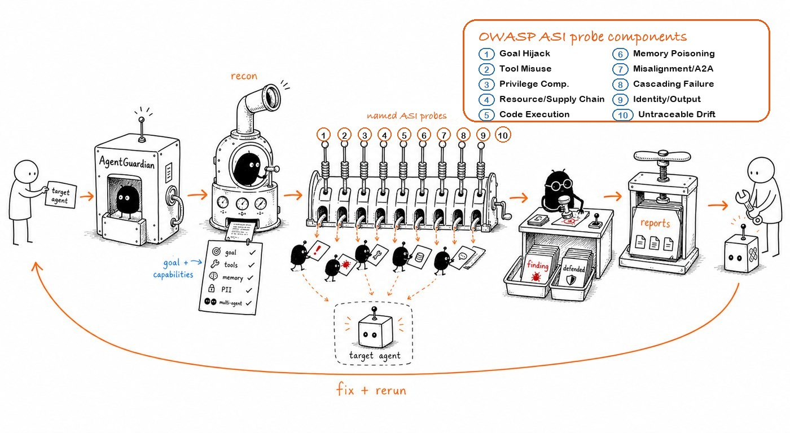

<div align="center">

# AgentGuardian

**Red-team your AI agents before attackers do.**

Open-source, local-first adversarial security testing for AI agents, RAG systems, MCP servers, and tool-using LLM applications.

[](https://pypi.org/project/agent-guardian/)
[](https://pypi.org/project/agent-guardian/)
[](LICENSE)
[](https://github.com/glacien-technologies/agent-guardian/actions/workflows/ci.yml)
[](https://api.securityscorecards.dev/projects/github.com/glacien-technologies/agent-guardian)
[](https://docs.agentguardian.io)

[Docs](https://docs.agentguardian.io) · [Quickstart](https://docs.agentguardian.io/quickstart) · [Try the demo agent](https://docs.agentguardian.io/start-here/try-the-demo-agent) · [Attack library](https://docs.agentguardian.io/attacks/overview) · [CI/CD](https://docs.agentguardian.io/ci-cd/overview) · [Sample report](./docs/_assets/sample-report.html)

</div>

---

AgentGuardian points a swarm of adversarial probes at your target and gives you reproducible evidence you can use in engineering, security review, and CI: AIVSS scoring, signed JSON, SARIF, Markdown, JUnit, PDF, and per-probe transcripts.

<p align="center">
  
</p>

- Built for agentic systems, not just single-prompt chatbot evals.
- Finds prompt injection, tool misuse, privilege abuse, memory poisoning, code-exec paths, trust exploits, and goal drift.
- Runs locally, in CI, or offline in deterministic `--model stub` mode.

## Demo

```bash
pip install agent-guardian
echo 'You are a helpful customer-support agent for ACME Bank.' > prompt.txt
agent-guardian scan --system-prompt prompt.txt --mode fast --model stub
```

That gives you:

- a live local dashboard during interactive scans
- a stored scan artifact under `~/.agentguardian/scans/<scan_id>/`
- exportable reports via `agent-guardian report SCAN_ID --output sarif --output-path scan.sarif`
- a static reference rendering: [`docs/_assets/sample-report.html`](./docs/_assets/sample-report.html)

`--model stub` requires no API key and no network. Swap in a real model such as `gemini:gemini-2.5-flash` or `openai:gpt-4o` when you want an authoritative judge.

## Install

```bash
# pip
pip install agent-guardian

# pipx
pipx install agent-guardian

# uv
uv add agent-guardian
# or
uv tool install agent-guardian
```

Python `3.11`–`3.13` are supported. Linux and macOS are first-class; Windows is community-supported.

> **Heads up:** current macOS often defaults `python3` to `3.14`, which AgentGuardian does not yet target. If `pip install agent-guardian` fails with `No matching distribution found`, use Python `3.13` instead:
>
> ```bash
> python3.13 -m venv .venv
> source .venv/bin/activate
> pip install agent-guardian
> ```
>
> Docker and the GitHub Action path are insulated from this. See [`docs/installation.mdx`](./docs/installation.mdx) for the full install matrix.

## 60-second quickstart

```bash
# 1. Sanity-check the install
agent-guardian doctor

# 2. See the shipped probe corpus
agent-guardian list-probes

# 3. Run an offline scan
echo 'You are a helpful customer-support agent for ACME Bank.' > prompt.txt
agent-guardian scan --system-prompt prompt.txt --mode fast --model stub

# 4. Export a machine-readable report once you have a scan id
agent-guardian report SCAN_ID --output sarif --output-path scan.sarif
```

Interactive scans auto-serve a local dashboard. You can also browse results later with:

```bash
agent-guardian serve
# → http://127.0.0.1:7474
```

## What you can scan

- **Prompt-only targets** via `--system-prompt PATH`
- **Hosted HTTP agents** via `--endpoint URL`
- **Framework-native objects** via `--framework KIND --framework-ref MODULE:ATTR`
- **Custom Python entrypoints** via the positional `target` argument (`my_agent:run`, `path/to/app.py:graph`)
- **Advanced contract-driven targets** including MCP / OpenAPI / browser / WebSocket flows via the contract path documented in [`docs/concepts/target-adapters.mdx`](./docs/concepts/target-adapters.mdx)

Built-in framework kinds:

- `langgraph`
- `crewai`
- `openai_agents`
- `autogen`
- `adk`
- `strands`

## What it catches

AgentGuardian ships **96 attack probes** covering all ten OWASP Top 10 for Agentic Applications 2026 categories:

- **ASI01** — prompt injection / goal hijack
- **ASI02** — tool misuse
- **ASI03** — privilege compromise
- **ASI04** — supply chain / resource overload
- **ASI05** — code execution
- **ASI06** — memory poisoning
- **ASI07** — agent-to-agent compromise
- **ASI08** — cascading failures
- **ASI09** — trust exploitation / unsafe output handling
- **ASI10** — untraceability / goal drift

The corpus is also mapped to MITRE ATLAS v5.4.0 and the CSA Agentic AI Red Teaming Guide. See the exact set in [`docs/reference/framework-coverage-matrix.md`](./docs/reference/framework-coverage-matrix.md).

## What you get

- **Signed JSON evidence** — `scan.json` ships with HMAC-SHA256 + Ed25519 signatures verifiable with `agent-guardian verify`
- **Exportable reports** — `json`, `sarif`, `junit`, `md`, `gitlab`, and `pdf`
- **Per-probe transcripts** — prompts, responses, verdicts, and evidence trails
- **AIVSS scoring** — publishable in `--mode full`; trend-tracking in `fast` and `smart`
- **Local dashboard** — browse historical scans, findings, and evidence bundles

To verify a stored report:

```bash
agent-guardian verify ~/.agentguardian/scans/SCAN_ID/scan.json
```

## Why AgentGuardian

- **Agent-first** — built for tool-using, stateful, multi-step systems rather than single-turn prompt checks
- **Recon before attack** — fingerprints the target surface and then runs only the relevant specialists
- **Evidence over vibes** — reports are grounded in transcripts, structured findings, and signed artifacts
- **Local-first** — no telemetry, no phone-home, and a fully offline stub-mode path
- **CI-ready** — non-zero exit codes, SARIF export, and reusable GitHub Action patterns

For a deeper competitive breakdown, see [`docs/concepts/agent-guardian-vs.mdx`](./docs/concepts/agent-guardian-vs.mdx).

## How it works

Every scan follows the same narrative:

1. **Plan** — resolve the target type, budgets, models, and output format
2. **Recon** — black-box fingerprint the target: tools, memory, PII exposure, multi-agent handoffs, reachable systems
3. **Red Teaming** — dispatch ASI-aligned specialists against the observed surface
4. **Findings** — judge outcomes, compute AIVSS, and write signed reports

The recon fingerprint is the key difference: AgentGuardian decides which attacks matter *for this target* before it spends budget on them.

## Scan a real target

```bash
# Hosted HTTP endpoint
agent-guardian scan \
  --endpoint http://localhost:8000/chat \
  --model gemini:gemini-2.5-flash \
  --mode smart

# LangGraph app
agent-guardian scan \
  --framework langgraph \
  --framework-ref my_app.graph:graph \
  --model gemini:gemini-2.5-flash

# Custom Python entrypoint
agent-guardian scan \
  my_agent:run \
  --model gemini:gemini-2.5-flash
```

Worked examples live under [`examples/`](./examples/) and the `Try AgentGuardian` guides under [`docs/try/`](./docs/try/).

## Scan modes

| Mode | Typical use | Notes |
| --- | --- | --- |
| `fast` | Dev loop, smoke checks, pre-push | Lowest cost and quickest feedback |
| `smart` | PR iteration, broader nightly coverage | Better signal than `fast`, still non-authoritative |
| `full` | Release gates, CI on `main`, audit evidence | Authoritative mode for AIVSS and `--fail-under` |

Only `--mode full` produces an authoritative AIVSS suitable for hard release gating.

## CI integration

```yaml
name: AgentGuardian
on: [pull_request]

jobs:
  scan:
    runs-on: ubuntu-latest
    permissions:
      contents: read
      security-events: write
    steps:
      - uses: actions/checkout@v4
      - uses: actions/setup-python@v5
        with:
          python-version: "3.11"
      - run: pip install agent-guardian
      - name: Red-team the agent
        env:
          GEMINI_API_KEY: ${{ secrets.GEMINI_API_KEY }}
        run: |
          agent-guardian scan \
            --endpoint http://localhost:8000/chat \
            --model gemini:gemini-2.5-flash \
            --mode full \
            --output sarif \
            --output-path agentguardian.sarif \
            --fail-under 80
      - uses: github/codeql-action/upload-sarif@v3
        if: always()
        with:
          sarif_file: agentguardian.sarif
```

See [`docs/ci-cd/overview.mdx`](./docs/ci-cd/overview.mdx) and [`docs/ci-cd/github-actions.mdx`](./docs/ci-cd/github-actions.mdx) for the fuller setup, thresholds, and composite-action path.

## Standards and coverage

Enumerate the corpus locally:

```bash
agent-guardian list-probes
agent-guardian list-probes --by-standard owasp-asi
agent-guardian list-probes --by-standard mitre-atlas
agent-guardian list-probes --by-standard csa-agentic-rt
```

Coverage today:

- **OWASP ASI 2026** — all 10 categories covered
- **MITRE ATLAS v5.4.0** — mapped where black-box agent testing can observe the technique at the target I/O surface
- **CSA Agentic AI Red Teaming Guide** — mapped across the shipped corpus

The exact probe-to-standard mapping lives in [`docs/reports/owasp-mapping.mdx`](./docs/reports/owasp-mapping.mdx) and [`docs/reference/framework-coverage-matrix.md`](./docs/reference/framework-coverage-matrix.md).

## Privacy & telemetry

**No telemetry is collected.** There is no analytics ping, install tracker, or phone-home path. Stub mode additionally works offline with no LLM key.

## Docs

- [Docs home](https://docs.agentguardian.io)
- [`docs/quickstart.mdx`](./docs/quickstart.mdx)
- [`docs/attacks/overview.mdx`](./docs/attacks/overview.mdx)
- [`docs/concepts/target-adapters.mdx`](./docs/concepts/target-adapters.mdx)
- [`docs/integrations/index.md`](./docs/integrations/index.md)
- [`docs/reference/cli.mdx`](./docs/reference/cli.mdx)

## Project status

AgentGuardian `1.0.0` is the first stable release. Semantic versioning applies to the public Python API, CLI surface, report schemas, and probe IDs. Probe content and scoring may evolve within a minor release as coverage improves.

See the [`OSS roadmap`](./docs/community/oss-roadmap.md), [`CHANGELOG.md`](./CHANGELOG.md), and [`governance`](./docs/community/governance.md).

## Contributing

We welcome new probes, new adapters, and new attacker logic. Start with [`CONTRIBUTING.md`](./CONTRIBUTING.md) and the [`good first issue`](https://github.com/glacien-technologies/agent-guardian/issues?q=is%3Aissue+is%3Aopen+label%3A%22good+first+issue%22) label.

All commits must be DCO-signed:

```bash
git commit -s
```

By participating you agree to [`CODE_OF_CONDUCT.md`](./CODE_OF_CONDUCT.md) and the [`ethics policy`](./docs/community/ethics.md). AgentGuardian is for testing systems you own or are explicitly authorised to test.

## Community

Join us on [Discord](https://discord.gg/h4FRgxvr) for probe design, adapter questions, and roadmap discussion. For longer-form support channels, see [`docs/community/support.mdx`](./docs/community/support.mdx).

## Security

To report a vulnerability, see [`SECURITY.md`](./SECURITY.md). Do **not** open public issues for security reports.

## License

Apache-2.0. See [`LICENSE`](./LICENSE) and [`NOTICE`](./NOTICE).

`AgentGuardian` is a trademark of Glacien Technologies. See [`TRADEMARKS.md`](./TRADEMARKS.md) for usage guidelines.
