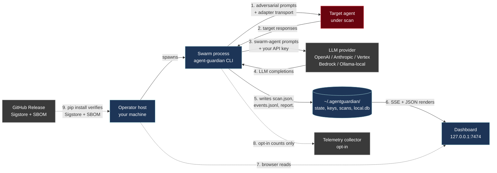

# Data flow

**TL;DR** — During a scan, prompts and target responses cross at most four trust boundaries: operator host → adversarial-target adapter, swarm agents → LLM provider, scan process → on-disk evidence pack, and (optional) operator host → dashboard / telemetry collector. This page enumerates exactly what crosses each one and what is logged.

## End-to-end diagram



## Per-arrow inventory

| # | Arrow | Payload | Direction | Whose API key / auth | What is logged | Source |
|---|---|---|---|---|---|---|
| 1 | Swarm → Target | Adversarial prompt (PAIR / TAP / Crescendo / MAD-MAX-generated) | egress from operator host | Adapter-configured (system-prompt adapter: no auth; HTTP adapter: bearer/header; code adapter: in-process; framework adapter: agent-internal). | One `SwarmEvent` per prompt in `events.jsonl`; redacted preview in `report.json`. | [`adapters/`](https://github.com/glacien-technologies/agent-guardian/tree/main/src/agent_guardian/adapters) |
| 2 | Target → Swarm | Target response text (and tool-call traces for MCP / framework adapters) | ingress | (target's own auth) | Same `SwarmEvent`; **content passes through `redact_finding`** before serialisation. | [`core/redact.py`](https://github.com/glacien-technologies/agent-guardian/blob/main/src/agent_guardian/core/redact.py) |
| 3 | Swarm → LLM provider | The swarm agents' own prompts (NOT the target's responses verbatim; the agents summarise / rewrite when reasoning). | egress over TLS to the provider's API host | Your provider API key from env (`OPENAI_API_KEY`, `ANTHROPIC_API_KEY`, etc.). | Token usage + agent name in `events.jsonl`; never the raw prompt-to-provider in `report.json`. | [`llm/`](https://github.com/glacien-technologies/agent-guardian/tree/main/src/agent_guardian/llm) |
| 4 | LLM provider → Swarm | Model completion (used by the swarm to plan the next attack). | ingress | — | Token usage counted in `Scan.cost`; raw content stays in memory unless the swarm decides to record it in a finding. | `llm/usage_tracking.py` |
| 5 | Swarm → Filesystem | `scan.json`, `events.jsonl`, `report.<format>` (json/sarif/junit/markdown/pdf). | local write, mode-0644 | — | The signed report **is** the log. | [`server/scan_store.py`](https://github.com/glacien-technologies/agent-guardian/blob/main/src/agent_guardian/server/scan_store.py) |
| 6 | Filesystem → Dashboard | Reads `events.jsonl` for live SSE; renders `report.json` for history views. | local read | Dashboard token if configured (see arrow 7). | Standard HTTP access log. | [`server/app.py`](https://github.com/glacien-technologies/agent-guardian/tree/main/src/agent_guardian/server) |
| 7 | Browser → Dashboard | HTTP `GET`s. | local → loopback by default | `Authorization: Bearer <token>` OR signed `ag_dash` cookie OR loopback origin. | Uvicorn access log. | [`server/auth.py`](https://github.com/glacien-technologies/agent-guardian/blob/main/src/agent_guardian/server/auth.py) |
| 8 | Swarm → Telemetry | Operational counts only (essential tier) or counts + adapter / Python / OS / arch (extended). **Never** prompts, findings, paths, keys. | egress over HTTPS, opt-out via `agent-guardian telemetry disable` | Pseudonymous `install_id` only. | See [telemetry.md](telemetry.md) for the complete allowlist. | [`telemetry/events.py`](https://github.com/glacien-technologies/agent-guardian/blob/main/src/agent_guardian/telemetry/events.py) |
| 9 | Installer → Release | `pip install agent-guardian` downloads the wheel and verifies the Sigstore signature + PEP-740 attestation. | ingress | — | pip's standard log. | [supply-chain.md](supply-chain.md) |

## What each LLM provider's API sees

Arrow 3 is the *most consequential* outbound flow for privacy: every swarm agent run by the scanner makes calls to your LLM provider. The table below documents what user-supplied content traverses each provider's API.

| Provider | Default endpoint | API key env var | What we send | Notes |
|---|---|---|---|---|
| **OpenAI** | `https://api.openai.com/v1/chat/completions` | `OPENAI_API_KEY` | Swarm-agent prompts; the agents see target responses internally and may include excerpts. | [`llm/openai.py:30,90`](https://github.com/glacien-technologies/agent-guardian/blob/main/src/agent_guardian/llm/openai.py) |
| **Anthropic** | `https://api.anthropic.com/v1/messages` | `ANTHROPIC_API_KEY` | Same shape as OpenAI. | [`llm/anthropic.py:29,118`](https://github.com/glacien-technologies/agent-guardian/blob/main/src/agent_guardian/llm/anthropic.py) |
| **Google Gemini (free tier)** | `https://generativelanguage.googleapis.com/v1beta` | `GEMINI_API_KEY` | Same shape. | [`llm/gemini.py:36,123`](https://github.com/glacien-technologies/agent-guardian/blob/main/src/agent_guardian/llm/gemini.py) |
| **Google Vertex AI** | `https://<region>-aiplatform.googleapis.com` | Vertex IAM (gcloud ADC) | Vertex live-fire path is **partial in v1.0** — see [providers/vertex.md](../integrations/providers/vertex.md). | [`llm/vertex.py:27`](https://github.com/glacien-technologies/agent-guardian/blob/main/src/agent_guardian/llm/vertex.py) |
| **AWS Bedrock** | `https://bedrock-runtime.<region>.amazonaws.com` | AWS SigV4 (boto3 credentials) | Bedrock model-name stripping is applied before request. | [`llm/bedrock.py:77`](https://github.com/glacien-technologies/agent-guardian/blob/main/src/agent_guardian/llm/bedrock.py) |
| **Ollama (local)** | `http://localhost:11434/api/chat` | — | **Stays on your machine.** Choose this if you must not let prompts cross a third-party API. | [`llm/ollama.py:27,81`](https://github.com/glacien-technologies/agent-guardian/blob/main/src/agent_guardian/llm/ollama.py) |
| **`stub`** | (none — in-process) | — | Local deterministic responder used for tests and the offline `agent-guardian doctor` path. Produces **non-authoritative** scans. | [`llm/stub.py`](https://github.com/glacien-technologies/agent-guardian/blob/main/src/agent_guardian/llm/stub.py) |

If your data-residency policy forbids prompts crossing a US-region API, point AgentGuardian at Ollama, a region-restricted Vertex endpoint, or a region-restricted Bedrock endpoint — the swarm makes the same calls; only the destination changes.

## On-disk inventory

Everything AgentGuardian persists lives under `$AGENT_GUARDIAN_HOME` (default `~/.agentguardian/`). The full layout:

```
~/.agentguardian/
├── state.json                       # consent + first-run flags ([cli.py:228](https://github.com/glacien-technologies/agent-guardian/blob/main/src/agent_guardian/cli.py))
├── install_id                       # pseudonymous UUID4, telemetry-only
├── keys/
│   ├── ed25519.priv                 # 32 raw bytes, mode 0600 ([ed25519_sig.py:79+](https://github.com/glacien-technologies/agent-guardian/blob/main/src/agent_guardian/crypto/ed25519_sig.py))
│   └── ed25519.pub                  # 32 raw bytes, world-readable
├── scans/
│   └── <scan_id>/
│       ├── scan.json                # final Scan model dump
│       ├── events.jsonl             # one SwarmEvent per line, append-only
│       ├── report.json              # signed JSON report ([reports/json_report.py](https://github.com/glacien-technologies/agent-guardian/blob/main/src/agent_guardian/reports/json_report.py))
│       ├── report.sarif             # SARIF 2.1.0 ([reports/sarif.py](https://github.com/glacien-technologies/agent-guardian/blob/main/src/agent_guardian/reports/sarif.py))
│       ├── report.md / report.html / report.pdf  # other render targets
│       └── audit.jsonl              # per-turn judge audit ([cli.py:2486](https://github.com/glacien-technologies/agent-guardian/blob/main/src/agent_guardian/cli.py))
├── local.db                         # telemetry buffer (SQLite); flushed to collector on emit ([telemetry/local.py](https://github.com/glacien-technologies/agent-guardian/tree/main/src/agent_guardian/telemetry))
└── analytics.db                     # OPTIONAL: collector backend when self-hosting [telemetry.md](telemetry.md)
```

Override the root with `AGENT_GUARDIAN_HOME=/path/to/dir` ([`cli.py:1844`](https://github.com/glacien-technologies/agent-guardian/blob/main/src/agent_guardian/cli.py)) — useful for multi-tenant CI runners that want per-target isolation.

Things explicitly **not** on disk:

- LLM provider API keys (read from env each scan).
- Plaintext of the HMAC secret (it is consumed at sign time and never written to disk).
- The verifier's pinned Ed25519 pubkey (the verifier provides it on each `verify` call).

## Dashboard exposure

- **Bind address.** Default `127.0.0.1:7474` ([`cli.py:1110-1112`](https://github.com/glacien-technologies/agent-guardian/blob/main/src/agent_guardian/cli.py)). Binding to a non-loopback host without `--token` (or `--insecure-no-auth`) prints a loud warning and is refused unless explicitly opted in.
- **Authentication.** Three accepted forms when `AGENT_GUARDIAN_DASHBOARD_TOKEN` (or `--token`) is set: loopback origin, `Authorization: Bearer <token>`, or HMAC-signed `ag_dash` cookie minted from `?token=...` ([`server/auth.py`](https://github.com/glacien-technologies/agent-guardian/blob/main/src/agent_guardian/server/auth.py)).
- **Redaction order.** Every JSON view and SSE event the dashboard emits is redacted through the same `redact_finding` path used by the file writers, so a dashboard token leak does not surface raw transcripts.
- **Telemetry-ingest endpoint.** When the dashboard process doubles as a self-hosted telemetry collector, the write endpoint stays loopback-only unless `--insecure-no-auth` is explicitly passed ([`cli.py:1136`](https://github.com/glacien-technologies/agent-guardian/blob/main/src/agent_guardian/cli.py)).

The `/healthz`, `/readyz`, and `/metrics` endpoints are intentionally unauthenticated so a reverse proxy can liveness-probe and a Prometheus scraper can pull metrics.

## Egress allowlist and `EgressRefused`

Target contracts ([`contract/`](https://github.com/glacien-technologies/agent-guardian/tree/main/src/agent_guardian/contract)) declare a per-target egress policy. The `RoeController` enforces it ([`core/roe.py`](https://github.com/glacien-technologies/agent-guardian/blob/main/src/agent_guardian/core/roe.py)):

- If `roe.data_egress.allow_external` is `False`, an attempt to egress non-allowlisted data raises `EgressRefused`. The exception is caught at the adapter layer, **the turn is counted in `egress_refused_turns`**, and a finding is recorded — the refusal is a deliberate test signal, not an internal error.
- Allowlisted tool calls follow the same pattern: `RoeController.tool_allowed()` ([`core/roe.py:385`](https://github.com/glacien-technologies/agent-guardian/blob/main/src/agent_guardian/core/roe.py)) is consulted before a tool is invoked; a `False` return increments a refused counter.

These counters are propagated into the signed report so a downstream verifier can see "the swarm tried to egress N times and was refused N times".

## See also

- [Threat model](threat-model.md) — why each arrow is where it is.
- [Signing & verification](signing.md) — how the on-disk artifacts become trustworthy.
- [Telemetry transparency](telemetry.md) — every field in arrow 8.
- [Operations / Observability](../operations/observability.md) — the metrics and OTel surface that the dashboard exposes.
