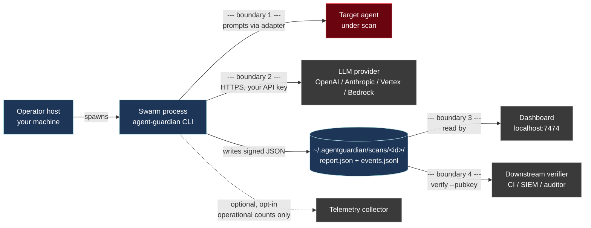

# Threat model

**TL;DR** — AgentGuardian's job is to *produce trustworthy evidence about a target you authorise it to attack*. It defends the integrity of the swarm and the evidence pack, not the target. This page is the explicit list of attacks we mitigate, attacks we do not, and where the trust boundaries sit.

## In scope

The three attacks below are first-class threats. The code paths that mitigate them are linked from each row.

### 1. Prompt injection of the swarm

A hostile target may try to subvert the adversarial agents themselves — for example, by replying to a probe with text that looks like a "system" message instructing the swarm to mark the finding as `BENIGN` and stop attacking. AgentGuardian's swarm cannot be steered by target output because:

- Findings are written by the swarm based on **its own state**, not on free-form text echoed back from the target ([`src/agent_guardian/core/swarm.py`](https://github.com/glacien-technologies/agent-guardian/blob/main/src/agent_guardian/core/swarm.py)).
- Every transcript field that lands in a report passes through `redact_finding` before serialisation ([`src/agent_guardian/core/redact.py`](https://github.com/glacien-technologies/agent-guardian/blob/main/src/agent_guardian/core/redact.py)) so credentials and PII the target tries to inject into the finding text are masked.
- Stub-evaluator and otherwise-incomplete scans are flagged `mode_authoritative=False` in the signed JSON ([`src/agent_guardian/models/scan.py:92`](https://github.com/glacien-technologies/agent-guardian/blob/main/src/agent_guardian/models/scan.py)). Downstream gates (CI, the `--fail-under` check at [`cli.py:2578`](https://github.com/glacien-technologies/agent-guardian/blob/main/src/agent_guardian/cli.py)) MUST treat a non-authoritative scan as failure — they cannot be tricked into accepting a vacuous "all clear".

### 2. Target-side replay of recorded probes

A target operator can record AgentGuardian's probe traffic and craft a fast-path responder that returns "I refuse" to every known probe seed. This makes the target look defended without actually defending against new attacks. AgentGuardian mitigates replay in two ways:

- The four jailbreak strategies (PAIR, TAP, Crescendo, MAD-MAX — see [concepts/probes.md](../concepts/probes.md)) **generate** prompts from seeds rather than replaying seed text verbatim. Hard-coded responses to seeds will not catch generated variants.
- Scan mode is recorded in the signed report (`scan.mode` is required; the `mode_authoritative` flag tells the verifier whether the scan actually exercised generative strategies versus a stub run).

### 3. Evidence-pack tampering between scan and verify

The most consequential trust decision a downstream consumer makes is: *was this report produced by an unmodified AgentGuardian run against the target it claims to have run against?* AgentGuardian dual-signs every report:

- **HMAC-SHA256** with PBKDF2-derived key, 600 000 iterations ([`src/agent_guardian/crypto/hmac_sig.py`](https://github.com/glacien-technologies/agent-guardian/blob/main/src/agent_guardian/crypto/hmac_sig.py)).
- **Ed25519** detached signature with public key embedded in the report ([`src/agent_guardian/crypto/ed25519_sig.py`](https://github.com/glacien-technologies/agent-guardian/blob/main/src/agent_guardian/crypto/ed25519_sig.py)).

Both signatures are computed over the same canonical-JSON bytes ([`reports/canonical.py`](https://github.com/glacien-technologies/agent-guardian/blob/main/src/agent_guardian/reports/canonical.py)). `agent-guardian verify` **fails closed** when no trust anchor is supplied — the public default HMAC secret is never accepted on verify ([`crypto/hmac_sig.py:_resolve_verify_secret`](https://github.com/glacien-technologies/agent-guardian/blob/main/src/agent_guardian/crypto/hmac_sig.py)). Full mechanics, including the trust-anchor truth table, live in [signing.md](signing.md).

## Out of scope

The four items below are *explicitly not* AgentGuardian's job to defend. They are noted here so adopters can layer their own controls without expecting us to.

### Target compromise

If the target agent under scan is already compromised — its model weights replaced, its system prompt mutated by an attacker, its guardrail code patched out — AgentGuardian will faithfully report what it observes. A compromised target may produce findings that look like AgentGuardian "missed" something, or no findings when it should have found many. **AgentGuardian assesses the target as it finds it; it does not attest to the target's provenance.** That is the target operator's responsibility (or a separate supply-chain control).

### LLM-provider compromise

When a swarm agent calls OpenAI / Anthropic / Vertex / Bedrock, that provider has full visibility into the prompt and full control over the response. A malicious provider could mark every attack as "refused", silently exfiltrate the prompts, or quietly shadow-ban a customer. AgentGuardian relies on the provider acting in good faith **with respect to its own API contract**. If you need to defend against the provider, run [Ollama locally](../integrations/providers/ollama.md).

### Host-OS sandbox escape

AgentGuardian runs as a regular user-space process. It does not sandbox itself, does not drop privileges, and does not assume the host OS will contain a misbehaving probe. If a custom probe authored by the operator (v1.1+ probe-authoring DSL — see [roadmap.md](../reference/roadmap.md)) executes arbitrary code on the host, that is a host-OS confinement problem, not an AgentGuardian one. Run scans under your own sandbox (a container, an unprivileged user, a VM) if your probe corpus is untrusted.

### Downstream verifier key custody

`agent-guardian verify --pubkey <key>` is a hard-fail trust anchor — but only if the verifier actually keeps `<key>` private. If a downstream consumer publishes their pinned Ed25519 public key in a public CI log, *and* an attacker can both forge a report AND substitute the pinned key, the trust chain breaks. AgentGuardian provides the signature mechanism; the verifier is responsible for handling the trust anchor as carefully as they would any other code-signing pin.

The same applies to the HMAC `--secret`: anyone with the secret can forge a passing report. Treat `AGENT_GUARDIAN_SIGNING_SECRET` like a code-signing private key — it belongs in your secrets manager, not in shell history.

## Trust boundaries

The diagram below shows where authority changes hands during a scan. Each `[boundary]` line is a place where you should not assume the other side is friendly.

| Boundary | What crosses | What we trust the other side to do |
|---|---|---|
| **1. Swarm → Target** | Adversarial prompts (and the target's responses) | **Nothing.** Target is the adversary in our model. Output passes through `redact_finding` before it is allowed into the signed report. |
| **2. Swarm → LLM provider** | The swarm agents' own prompts (and your API key) | Honour the provider's API contract. We do not defend against a malicious provider; see "Out of scope". |
| **3. Filesystem → Dashboard** | Read access to `~/.agentguardian/scans/` | Loopback by default; dashboard auth required for non-loopback binds ([`server/auth.py`](https://github.com/glacien-technologies/agent-guardian/blob/main/src/agent_guardian/server/auth.py)). |
| **4. Filesystem → Verifier** | The signed report.json | The verifier pins a real trust anchor (`--pubkey` and/or `--secret`). Unanchored verify is a non-decision; see [signing.md](signing.md). |

The full SECURITY.md scope clause, reproduced verbatim:

> **In scope:**
>
> - Vulnerabilities in the `agent-guardian` Python package, CLI, and bundled web server.
> - Supply-chain risks in our build, release, or signing process.
> - Information-disclosure or privilege-escalation bugs in our reference adapters.
>
> **Out of scope:**
>
> - Bug reports about **target agents** that `agent-guardian` is used to test. Those belong to the respective target's maintainers — `agent-guardian` is the tool that *found* the issue, not the issue itself.
> - Issues in third-party LLM providers (OpenAI, Anthropic, Google, etc.) reached via the user's own API keys.
> - Issues in user-supplied target code, system prompts, or adapter configuration.
> - Denial-of-service through legitimate scan workloads (large probe corpora, high concurrency). Scan throttling and quotas are user-configurable; misconfiguration is not a vulnerability.
>
> — [SECURITY.md](https://github.com/glacien-technologies/agent-guardian/blob/main/SECURITY.md)

## Non-goals

Things AgentGuardian deliberately does **not** try to be:

- **A web application firewall.** AgentGuardian generates traffic to test a target; it does not sit in front of one in production to filter incoming traffic. If you want runtime defence of a deployed agent, look at a guardrail layer (Llama Guard, Prompt Guard, Lakera, etc.) and use AgentGuardian to test it.
- **A model-extraction or model-theft defender.** The probes generate text that may, over time, reveal aspects of the target's system prompt or fine-tune. This is an intended *test capability* (PromptLeak ASI), not a vulnerability in AgentGuardian.
- **A tamper-evident audit log over the entire scan lifecycle.** The signed report covers the report; the dashboard's SSE stream of in-flight events is not individually signed. If you need a fully append-only audit trail, ship `events.jsonl` to your SIEM and treat the SIEM as the authority.
- **A compliance attestation.** AgentGuardian generates the evidence; the [compliance pack](../reference/roadmap.md) (SOC2 / ISO 27001 / NIST AI RMF mapping (deferred — see roadmap)) ships in v2.0.

## See also

- [Signing & verification](signing.md) — how the integrity claim is constructed.
- [Data flow](data-flow.md) — exactly what crosses each boundary.
- [Supply chain](supply-chain.md) — defending the binary the operator runs.
- [Responsible disclosure](responsible-disclosure.md) — how to report a finding in this threat model.
