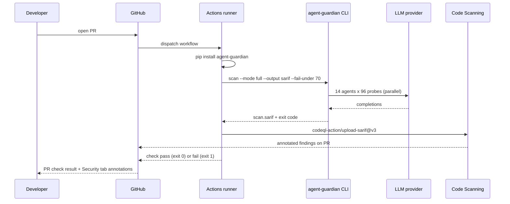

## What this gives you

A PR check that fails when the AgentGuardian AIVSS score drops below your floor, with every finding annotated inline in GitHub's **Security** tab via the official `github/codeql-action/upload-sarif@v3` action.

## When to add this

- The first time an LLM agent lands in `main` and needs a regression gate.
- On every release branch, before tagging.
- Before any change that touches the agent's system prompt, tool surface, or memory layer.

## Wire it up

<Steps>
  <Step title="Drop in the workflow" icon="file-plus">
    Create `.github/workflows/agent-guardian.yml` with the YAML below. The
    `permissions: security-events: write` block is required by
    `github/codeql-action/upload-sarif@v3` to publish annotations to Code Scanning.

    ```yaml .github/workflows/agent-guardian.yml
    name: AgentGuardian Red Team Scan

    on:
      pull_request:
      push:
        branches: [main]

    permissions:
      contents: read
      security-events: write   # required for codeql-action/upload-sarif

    jobs:
      redteam:
        runs-on: ubuntu-latest
        steps:
          - uses: actions/checkout@v4

          - name: Set up Python
            uses: actions/setup-python@v5
            with:
              python-version: "3.12"

          - name: Install AgentGuardian
            run: pip install agent-guardian

          - name: Run scan
            env:
              GEMINI_API_KEY: ${{ secrets.GEMINI_API_KEY }}
            run: |
              agent-guardian scan \
                --framework langgraph \
                --framework-ref my_app.graph:graph \
                --model gemini:gemini-2.5-flash \
                --mode full \
                --budget-usd 0.10 \
                --output sarif \
                --output-path scan.sarif \
                --fail-under 70

          - name: Upload SARIF to GitHub Code Scanning
            if: always()
            uses: github/codeql-action/upload-sarif@v3
            with:
              sarif_file: scan.sarif
    ```
  </Step>

  <Step title="Pick a target" icon="crosshair">
    Replace `my_app.graph:graph` with the dotted reference to your real
    framework-native object. Supported `--framework` values: `adk`,
    `autogen`, `crewai`, `langgraph`, `openai_agents`, `strands`.

    For a hosted HTTP agent, swap the framework flags for
    `--endpoint https://my-agent.example.com/chat` and set
    `AGENT_GUARDIAN_AUTH_BEARER` from a repo secret.
  </Step>

  <Step title="Add the provider secret" icon="key">
    Repo **Settings → Secrets and variables → Actions → New repository
    secret**. Add the key matching your `--model` choice:
    `GEMINI_API_KEY`, `OPENAI_API_KEY`, `ANTHROPIC_API_KEY`, or use
    `--model stub` for an offline smoke check (note: stub runs are
    non-authoritative — they always fail `--fail-under`, see below).
  </Step>

  <Step title="Open a PR" icon="git-pull-request">
    Push the workflow on a branch and open a pull request. The
    `AgentGuardian Red Team Scan / redteam` check appears in the PR
    conversation and the SARIF findings appear under **Security → Code
    scanning** after the run completes.
  </Step>
</Steps>

<Warning>
  `--fail-under` only gate-passes on `--mode full`. A `fast` or `smart`
  scan returns exit code **1** even if the numeric AIVSS clears the
  floor — fast/smart scans are designed as iteration smoke checks, not
  release gates. This is enforced in
  [`cli.py:3114–3129`](https://github.com/glacien-technologies/agent-guardian/blob/main/src/agent_guardian/cli.py#L3114-L3129).
  Use `--mode full` on the workflow that gates merges.
</Warning>

## The full flow



## Expected output on a PR

A passing run prints the scan summary to the job log and exits `0`:

```text expandable
scan ag_2026_8f3a91cd done: AIVSS=82 band=low_risk tier=T2 findings=3 report=scan.sarif
```

A failing run prints the gate decision to **stderr** and exits `1`:

```text expandable
scan ag_2026_8f3a91cd done: AIVSS=58 band=elevated_risk tier=T2 findings=11 report=scan.sarif
--fail-under 70: FAILED -- AIVSS 58 < floor 70
```

In both cases the SARIF is uploaded (the upload step uses `if: always()`),
so every finding shows up in the PR's **Files changed → Annotations** lane
and under **Security → Code scanning alerts**.

## How to interpret the exit code

The CLI uses six exit codes, defined verbatim in
[`cli.py:83–89`](https://github.com/glacien-technologies/agent-guardian/blob/main/src/agent_guardian/cli.py#L83-L89).
The gate condition you wire into the workflow should care about exactly
two of them — `0` (pass) and `1` (gate failed). The rest are signals that
something else went wrong and the scan never produced a verdict.

| Exit code | Constant | Meaning | What to do in CI |
|-----------|----------|---------|------------------|
| `0` | `EXIT_OK` | Scan completed and AIVSS ≥ `--fail-under`. | Merge. |
| `1` | `EXIT_FAIL_UNDER` | Scan completed and AIVSS < `--fail-under`, **or** the scan was non-authoritative (`--mode fast`/`smart`, or `--model stub`). | Block merge. Read the SARIF annotations to triage. |
| `2` | `EXIT_CONFIG` | Bad invocation — unknown flag, conflicting target modes, malformed `--contract`. | Fix the workflow YAML. Not a security regression. |
| `3` | `EXIT_TARGET_UNREACHABLE` | The pre-scan reachability probe for `--endpoint` mode failed. | Check that the agent is up before the scan step (e.g. add a `curl --retry` health check). |
| `4` | `EXIT_LLM_PROVIDER` | The LLM provider returned an unrecoverable error (rate limit, auth, network). | Re-run the workflow. Check the provider secret. |
| `5` | `EXIT_SANDBOX` | The sandboxed code adapter refused to load the target. | Inspect the job log; fix the target reference. |
| `130` | `EXIT_USER_INTERRUPT` | The runner cancelled the job (timeout, manual cancel). | Re-run; consider raising `--budget-usd` if the scan is timing out. |

<Tip>
  Cap the scan's spend with `--budget-usd` so a runaway provider can never
  cost more than you've budgeted per PR. The swarm soft-stops new attack
  turns at 80% of the cap and reserves the remainder for the report
  emission step.
</Tip>

## Tuning the floor

Start permissive on the first PR (`--fail-under 60`) and tighten as you
land mitigations. A reasonable progression:

- **First two weeks** — `--fail-under 60`. Catches catastrophic regressions
  only; lets the team see what a real swarm finds without blocking every
  merge.
- **Steady state** — `--fail-under 70`. Matches the `low_risk` band
  boundary; rejects merges that introduce a medium-severity ASI01/ASI02
  finding.
- **Hardened release branch** — `--fail-under 80`. Matches the `safe` /
  `low_risk` boundary; only ships when the agent has no high-severity
  open findings.

Band cutoffs are defined in
[`src/agent_guardian/models/severity.py`](https://github.com/glacien-technologies/agent-guardian/blob/main/src/agent_guardian/models/severity.py)
(function `band_for_score`).

## Next step

<CardGroup cols={2}>
  <Card title="Reports" icon="file-text" href="/reports/overview">
    Open the `scan.sarif` and the signed `scan.json` produced by every run.
  </Card>
  <Card title="First scan" icon="play" href="/first-scan">
    Run the same command locally against the bundled vulnerable demo
    before you wire it into CI.
  </Card>
  <Card title="Attack library" icon="shield-alert" href="/attacks/overview">
    See the 96 probes across 10 ASI categories the gate is exercising.
  </Card>
  <Card title="Contributing" icon="users" href="/contributing">
    Add a GitLab or Jenkins variant — same CLI, same exit codes.
  </Card>
</CardGroup>
