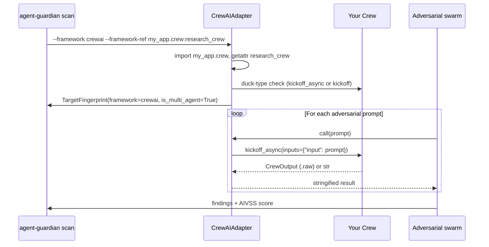

One-line: wrap your `Crew` with `CrewAIAdapter` (or let the CLI do it via `--framework crewai`) and run a scan against the multi-agent kickoff loop.

## When to use this

- You have a CrewAI `Crew` defined in your codebase and want a pre-production red-team pass before it ships.
- You want the swarm to treat the whole crew as one black-box target — the adapter sends each adversarial prompt through `Crew.kickoff_async(inputs={"input": prompt})` and stringifies the result.
- You do **not** need per-task instrumentation. The adapter wraps the crew at the kickoff boundary; finer hook firing inside CrewAI is best-effort today (see *How it works* below).

## What the adapter accepts

`CrewAIAdapter` duck-types — CrewAI itself is **not** a dependency of `agent-guardian`. It accepts any object that exposes either:

- `kickoff_async(inputs: dict)` (preferred, async), or
- `kickoff(inputs: dict)` (sync; the adapter offloads to a thread via `asyncio.to_thread`).

The return value is stringified. Newer CrewAI returns a `CrewOutput` dataclass — the adapter reads `.raw` if present, otherwise falls back to `str(result)`.

Source: [`src/agent_guardian/adapters/framework/crewai.py`](https://github.com/glacien-technologies/agent-guardian/blob/main/src/agent_guardian/adapters/framework/crewai.py).

## Run it — CLI

The CLI's `--framework crewai` flag pairs with `--framework-ref MODULE:ATTR`, which the CLI imports and hands to `CrewAIAdapter`.

```bash
uv run agent-guardian scan \
  --framework crewai \
  --framework-ref my_app.crew:research_crew \
  --model openai:gpt-4o \
  --tier T2 \
  --budget-usd 5 \
  --output sarif \
  --output-path crewai-scan.sarif
```

`my_app.crew:research_crew` must resolve to a module-level `Crew` instance in your project (the CLI imports `my_app.crew` and reads the `research_crew` attribute). The colon form (`MODULE:ATTR`) and dotted form (`MODULE.ATTR`) are both accepted.

## Run it — Python

```python
from crewai import Agent, Crew, Task

from agent_guardian import CrewAIAdapter
from agent_guardian.runner import scan  # see Reference → Python API

researcher = Agent(role="Researcher", goal="Answer the user's question", backstory="...")
task = Task(description="{input}", expected_output="A concise answer.", agent=researcher)
crew = Crew(agents=[researcher], tasks=[task])

adapter = CrewAIAdapter(crew, ref="docs.example.research_crew")

result = await scan(target=adapter, model="openai:gpt-4o", tier="T2", budget_usd=5.0)
print(result.aivss_score, result.findings)
```

The adapter's `TargetFingerprint` declares `mode="framework"`, `framework="crewai"`, `has_tools=True`, `is_multi_agent=True`. The orchestrator uses these flags to route the right probe families (tool-abuse and multi-agent coordination probes get unlocked).

## Expected output

A scan against a CrewAI `Crew` produces the standard AgentGuardian report. The framework adapter is reported under `target.framework`:

```json
{
  "scan_id": "scan_2026...",
  "target": {
    "mode": "framework",
    "framework": "crewai",
    "ref": "my_app.crew:research_crew",
    "fingerprint": {
      "has_tools": true,
      "has_memory": false,
      "is_multi_agent": true
    }
  },
  "aivss_score": 6.4,
  "findings": [
    { "id": "F-001", "probe": "prompt_injection.system_override", "severity": "HIGH" }
  ]
}
```

The SARIF output (`--output sarif`) is consumable by GitHub Code Scanning — see [CI/CD → GitHub Actions](/ci/github-actions).

## How to interpret the result

- `target.framework: "crewai"` confirms the adapter was wired correctly. If you see `"code"` or `"custom"` here, the CLI fell back — re-check `--framework-ref`.
- `is_multi_agent: true` means probes like memory poisoning across agents and inter-agent collusion are eligible to run.
- A finding under `probe: "prompt_injection.*"` against a CrewAI target usually means a single crew member capitulated; trace `evidence.transcript` to identify which `Agent.role` produced the leak.
- `aivss_score` is the headline severity (0–10). Use `--fail-under N` in CI to fail the build above your threshold.

## How it works



Caveats:

- Hook firing from inside CrewAI is **best-effort**. The adapter sees the kickoff boundary, not the per-agent step boundary. Per-step instrumentation is on the roadmap.
- The scan input is always shaped as `{"input": prompt}`. If your tasks expect different `inputs` keys, write a thin wrapper crew whose `Task.description` uses `{input}` and routes from there.

## Next step

- Add the scan to CI: [GitHub Actions](/ci/github-actions)
- Compare with other frameworks: [LangGraph](/examples/langgraph-agent), [OpenAI Agents SDK](/examples/openai-agents)
- Read the attack catalog: [Attack library overview](/attacks/overview)
