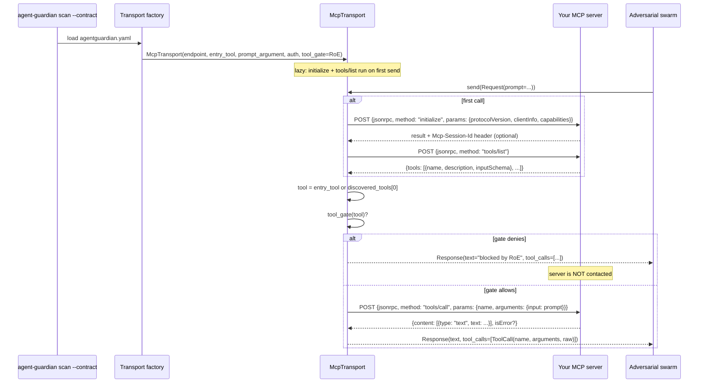

One-line: declare the MCP endpoint in an `agentguardian.yaml` contract, then run `agent-guardian scan --contract`. The transport speaks JSON-RPC 2.0 over MCP Streamable HTTP, discovers tools via `tools/list`, and drives each adversarial prompt through `tools/call`.

## When to use this

- You expose tools to an agent through an MCP server (Streamable HTTP, or legacy SSE) and want a black-box red-team pass against the tool surface.
- You want the swarm to attack the **server** itself — tool poisoning, schema confusion, destructive-tool gating, session bleed — rather than a specific LLM client that happens to use it.
- You want Rules of Engagement to live next to the server config (in YAML) so the same allow/blocklist applies in CI as on a laptop.

The MCP transport is contract-only: there is no `--mcp-url` CLI flag. MCP servers carry session state, tool surfaces, and (often) OAuth-protected resources — the contract is the right place to declare all three.

Source: [`src/agent_guardian/transports/mcp.py`](https://github.com/glacien-technologies/agent-guardian/blob/main/src/agent_guardian/transports/mcp.py), [`src/agent_guardian/contract/schema.py`](https://github.com/glacien-technologies/agent-guardian/blob/main/src/agent_guardian/contract/schema.py) (`McpTransport`).

## What the transport accepts

The contract's `target.transport` block for MCP supports the following fields (from `McpTransport` in `contract/schema.py`):

| Field             | Type                              | Default            | Notes                                                              |
| ----------------- | --------------------------------- | ------------------ | ------------------------------------------------------------------ |
| `kind`            | `"mcp"`                           | required           | Discriminator                                                       |
| `url`             | URL                               | required           | The MCP JSON-RPC endpoint                                           |
| `transport_type`  | `"streamable_http"` \| `"sse"`    | `"streamable_http"` | Streamable HTTP is the modern default                              |
| `entry_tool`      | string \| `null`                  | `null`             | Tool to invoke each turn. When `null`, the first discovered tool is used |
| `prompt_argument` | string                            | `"input"`          | Argument name the adversarial prompt is mapped onto                |
| `init_timeout_ms` | int                               | `30000`            | Timeout for the `initialize` handshake (and downstream RPCs)        |

For authenticated MCP servers, the contract's `target.auth` block can use `kind: mcp_oauth` — MCP OAuth 2.1 + PKCE (S256) with RFC 9728 Protected-Resource-Metadata discovery (`McpOAuthAuth`). Bearer credentials are applied as the `Authorization` header only, per spec.

## Author the contract

Create `agentguardian.yaml` next to your project. This is a minimal MCP target with no auth and a stateless session, plus a Rules-of-Engagement block that allow-lists one tool and blocks a destructive one:

```yaml
version: 1
target:
  name: mcp-search
  environment: staging
  transport:
    kind: mcp
    url: https://mcp.example.com/rpc
    transport_type: streamable_http
    entry_tool: search
    prompt_argument: input
    init_timeout_ms: 30000
  response:
    output_path: $.output.text
  session:
    mode: stateless
roe:
  data_egress:
    allow_external: true
  tools:
    allowlist: [search]
    blocklist: [delete_everything]
```

The `roe.tools.blocklist` is the live RoE chokepoint: before any `tools/call` the transport asks the gate whether the tool name is allowed; a blocked tool never contacts the server (the transport returns a benign blocked note and a recorded `ToolCall` instead — see `McpTransport.send` in `transports/mcp.py`).

Pre-flight will fail if your allow/blocklist names a tool the server did not advertise — the discovered set from `tools/list` is reconciled against the RoE.

## Run it

```bash
uv run agent-guardian scan \
  --contract ./agentguardian.yaml \
  --model openai:gpt-4o \
  --tier T2 \
  --budget-usd 5 \
  --output sarif \
  --output-path mcp-scan.sarif
```

`--contract` is mutually exclusive with the positional `target` / `--system-prompt` / `--endpoint` / `--framework` modes. The contract supplies the transport, auth, session, and RoE; budgets in the contract map onto the swarm config, and a provenance audit is attached to the report.

## Expected output

The scan emits a standard AgentGuardian report. The target block reflects the contract-driven path and the discovered MCP transport:

```json
{
  "scan_id": "scan_2026...",
  "target": {
    "mode": "contract",
    "name": "mcp-search",
    "environment": "staging",
    "transport": {
      "kind": "mcp",
      "endpoint": "https://mcp.example.com/rpc",
      "supports_tools": true,
      "session_modes": ["stateless", "server_session"],
      "discovered_tools": ["search", "delete_everything"]
    }
  },
  "aivss_score": 5.8,
  "findings": [
    { "id": "F-001", "probe": "asi04.mcp-server-poison", "severity": "MEDIUM" }
  ]
}
```

If the server returned an `Mcp-Session-Id` response header, the transport captures it and replays it as a request header on every later call so the server can resume the same session (this is MCP's `server_session` mode, advertised in `session_modes`).

## How to interpret the result

- `transport.discovered_tools` is the live `tools/list` result. If a tool you expected is missing, the server did not advertise it on this version of the handshake — re-check the deployment.
- A finding under `asi04.mcp-server-poison` (the in-tree MCP probe at `src/agent_guardian/probes/asi04/mcp-server-poison.yaml`) means an attacker payload tried to register an untrusted MCP server (`https://tools.attacker.test/mcp`, etc.) and the target acknowledged or began using it. That is a supply-chain failure; the remediation is the RoE allow-list.
- A finding under `tool_abuse.*` against a tool you allow-listed means the live RoE block did **not** trip — i.e. the gate let the call through and the server (or downstream tool) misbehaved with the adversarial argument.
- The transport never raises for a fault. A protocol-level failure (JSON-RPC `error` member, no tools advertised) is folded into `Response.error` with a category — `BLOCKED` when the server's error message contains a refusal hint (`forbidden`, `denied`, `not allowed`, `blocked`, `unauthorized`), `PROTOCOL` otherwise.

## How it works



A few invariants worth knowing:

- **Discovery runs exactly once.** `_ensure_discovered` checks the `_initialized` / `_tools_listed` flags; subsequent turns skip straight to `tools/call`.
- **Session isolation.** When `Request.session` is set (the seam `SessionMachine.isolate_per_scenario` uses after `server_session` mode is detected), the per-call `Mcp-Session-Id` header is pinned and the transport-level captured id is **not** overwritten from the response. Two parallel scenarios over the same shared `McpTransport` therefore cannot bleed session ids.
- **Auth lives in the `Authorization` header.** Both static bearer credentials and the MCP OAuth 2.1 + PKCE flow are applied through the `AuthContext` into headers — never a query string, per the MCP spec.
- **Resilience mirrors the HTTP transport.** Every RPC is wrapped in `with_backoff`; `429` honours `Retry-After`; `408` / `5xx` are transient; `401` / `403` raise `LLMAuthError`; httpx timeouts and network faults are mapped to `TransportError`.

## How auth works (MCP OAuth)

If your MCP server is an OAuth-protected resource, swap the `auth` block:

```yaml
target:
  # ... transport block as above ...
  auth:
    kind: mcp_oauth
    client_id: ${env:MCP_CLIENT_ID}
    client_secret: ${env:MCP_CLIENT_SECRET}   # omit for public clients
    scopes: [tools.read, tools.call]
    # resource: optional override; defaults to deriving from the transport url
    # token_url: optional explicit override that skips RFC 9728 discovery
```

`McpOAuthProvider` performs the full MCP authorization flow: it fetches `{resource}/.well-known/oauth-protected-resource` (RFC 9728 Protected-Resource-Metadata) to discover the `authorization_servers`, runs the authorization-code + PKCE (S256) flow, and applies the bearer token in the `Authorization` header. The token-fetch client is separate from the data-plane httpx client and is closed via `aclose` cascade.

## Next step

- Author your contract with the wizard: `uv run agent-guardian contract new`
- Add it to CI: [GitHub Actions](/ci/github-actions)
- Read the MCP-specific probe: [`asi04.mcp-server-poison`](/attacks/overview) under ASI04 supply-chain
- See the attack catalogue: [Tool abuse](/attacks/tool-abuse)
