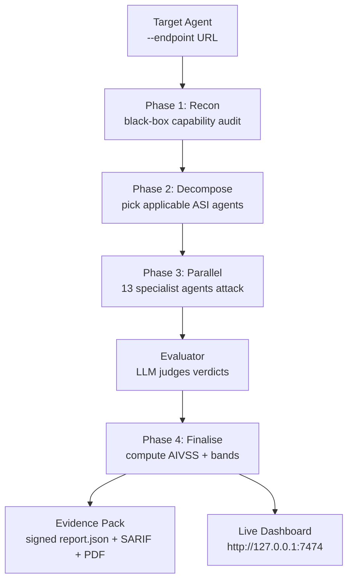

## The core idea

AgentGuardian generates adversarial scenarios, executes them against a
target agent, evaluates whether the agent violated an expected safety or
security boundary, and produces evidence-backed findings. That is the
whole product — every flag, every report format, and every dashboard
panel is one of those four steps made operable.

<Info>
  **Two LLMs, not one.** A scan uses an *attacker* LLM (synthesises
  prompts) and an *evaluator* LLM (judges each turn). They can be the
  same model or different models. See `agents/base.py::Judge` — the
  judge is intentionally separate from the strategy so attack
  decisions and outcome labels never share a chain-of-thought.
</Info>

## The four phases of a scan

A scan is one call to `SwarmCommander.run`. It walks four phases in
order. Phases 1, 2, and 4 are sequential; Phase 3 is the only place
parallelism happens.

### Phase 1 — Recon

A single `ReconAgent` interrogates the target with a black-box
capability audit (`recon_audit_rounds` = 10 by default) and produces a
`TargetFingerprint`: tools surfaced, memory present, multi-agent
hand-offs, PII exposure, external systems reachable. On timeout or
error, the swarm falls back to a minimal fingerprint synthesised from
the adapter's static description, so a flaky target never blocks the
scan.

The fingerprint is the input to every later phase — it decides which
specialists run and what each one prioritises.

### Phase 2 — Decompose

The swarm instantiates the ten ASI specialist agents (one per OWASP
ASI 2026 category) plus the four OWASP-LLM specialists when
`--include-m2-agents` is set, then filters them through
`AsiAgent.is_applicable(fingerprint)`. A tool-less target skips
ASI02 (Tool Abuse). A memory-less target skips ASI06 (Memory
Poisoning). The global token budget is sliced across whichever
agents survive the filter.

When an operator passes `--target-goal "exfiltrate PII"`, a Commander
LLM additionally emits a `SwarmBrief` JSON object — per-agent
sub-goals, hypotheses, and priority weights — that downstream agents
synthesise goal-specific scenarios from. Without `--target-goal` the
Commander step is skipped and agents use their bundled probe corpus.

### Phase 3 — Parallel attack

Up to `max_parallel_agents` (default 10) specialists run concurrently
under an `asyncio.TaskGroup`. Each agent owns one ASI category, runs
its own attack loop — generate prompt, send to target, evaluator
judges the response, write a `Finding` on `verdict="fail"` — and
terminates when it hits any of: target findings reached, turn cap,
budget exhausted, refused, or the wall-clock window closes.

A concurrent checkpoint task samples provisional AIVSS every 30s and
can vote `EARLY_STOP` if the score has stabilised — disabled by
default in `--mode full`, enabled in `--mode smart` and `--mode fast`.

### Phase 4 — Finalise

The swarm aggregates findings, recomputes AIVSS deterministically
from the full finding set, attaches the `SeverityBand`
(`safe / low_risk / elevated_risk / high_risk / critical_risk`),
optionally runs the PoV (Proof-of-Vulnerability) reproduction gate
and the Critic rubric, then signs the canonical `scan.json` with
HMAC + Ed25519 and persists it under
`~/.agentguardian/scans/<scan_id>/`.

## What you get back

Every scan produces the same three things, regardless of which
flags you passed:

1. **A signed `scan.json`** — the canonical evidence file. Every other
   report format is derived from this one. See [Reports overview](/reports/overview).
2. **Whatever `--output` you asked for** — SARIF for GitHub Code
   Scanning, JUnit for any CI, Markdown for PR comments, PDF for
   auditors.
3. **An auto-served Live Dashboard** at
   `http://127.0.0.1:7474/scans/<scan_id>` (suppress with
   `--no-serve`). The dashboard reads the same `scan.json` plus a live
   reflection feed for in-flight scans.

## Why this shape

Four design constraints drove the swarm shape — they're worth knowing
because they explain every weird-looking knob in the CLI:

- **Determinism.** Same `--seed`, same target, same model versions →
  same AIVSS. The Commander LLM step is the one non-deterministic
  layer; everything downstream of `SwarmBrief` is reproducible.
- **Specialist isolation.** Each agent owns one ASI category and one
  `allowed_tools` allowlist. A bug or a runaway in `MemoryPoisonAgent`
  cannot corrupt `ToolAbuseAgent`'s findings — they share memory,
  not state.
- **Fail-open on recon, fail-closed on signatures.** A degraded
  fingerprint still produces a scan; a missing Ed25519 anchor refuses
  to verify a report. The right things are loud.
- **The judge is separate from the attacker.** An attacker LLM that
  also grades its own output would inflate the score. The evaluator
  LLM only sees `(prompt, response)` pairs and a category-specific
  rubric — never the strategy's chain-of-thought.

## Where to go deeper

This page is the mental model. For the implementation:

- [Architecture: system overview](/architecture/system-overview) — the
  package map, public SDK surface, where each subsystem lives.
- [Concepts: the swarm](/concepts/swarm) — the 10 ASI agents plus the
  4 OWASP-LLM specialists, parallelism limits, Commander prompt.
- [Concepts: AIVSS](/concepts/aivss) — the scoring formula, severity
  weights, tier weights, band cut-offs.
- [Concepts: scan modes](/concepts/scan-modes) — when `fast`, `smart`,
  and `full` differ and which one your CI should run.
- [Attack library](/attacks/overview) — the 96 probes the specialists
  draw from.
- [Reports overview](/reports/overview) — the five emitters and the
  evidence-pack layout.
